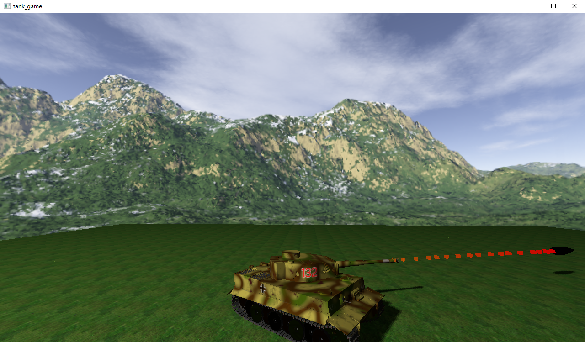

# Simple Tank Game

一个简单的基于 OpenGL 和 C++ 的坦克游戏，参考了 [LearnOpenGL 中文教程](https://learnopengl-cn.github.io/)。



## 构建

``` bash
cd ${path_to_this_repo}
cmake -B build [-G Ninja | ...] [-DTANKGAME_BUILD_TEST=1] . 
cd build
[make | mingw32-make | ninja | msbuild ...]
```

## 操作方式

| 按键     | 效果         |
| -------- | ------------ |
| `W`      | 前进         |
| `S`      | 后退         |
| `A`      | 左转         |
| `D`      | 右转         |
| `Q`      | 左转炮管     |
| `E`      | 右转炮管     |
| 鼠标左击 | 发射炮弹     |
| 鼠标右击 | 重置炮管位置 |
| 鼠标移动 | 调整视角     |
| 鼠标滚轮 | 调整fov      |
| `ESC`    | 退出游戏     |

## 实现功能

- obj 模型的读取与渲染
- Blinn-Phong 光照模型
- 纹理贴图
- 阴影贴图
- 天空盒
- 粒子效果